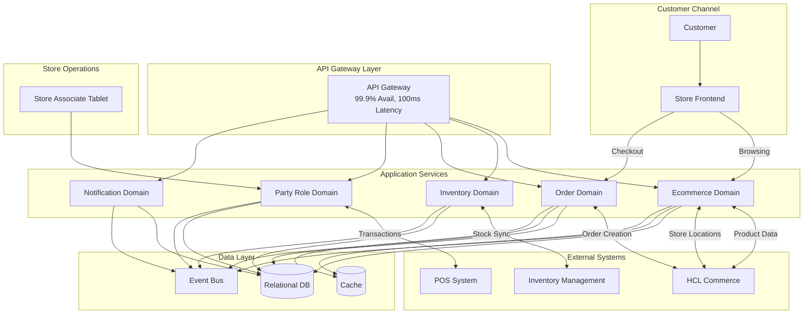
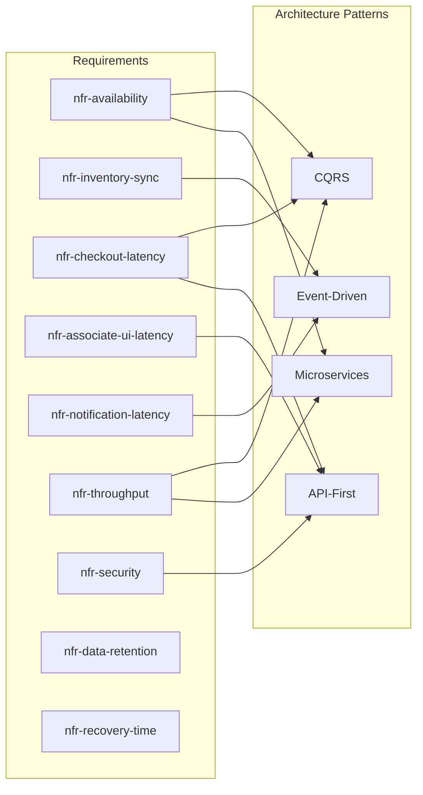
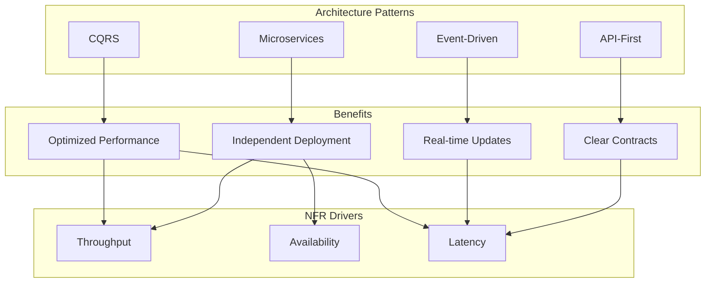
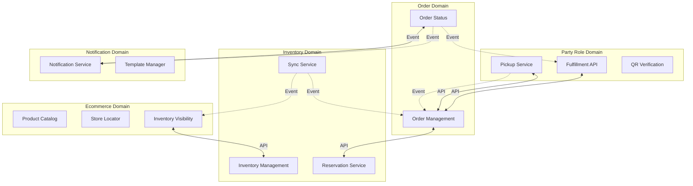
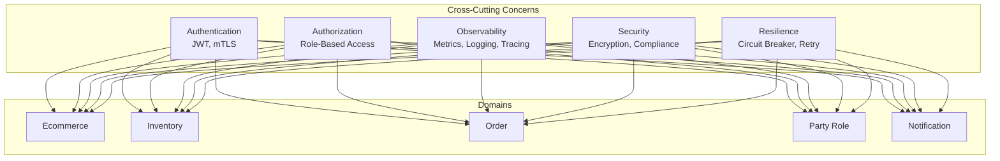
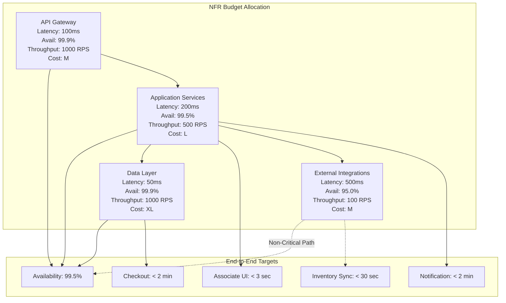
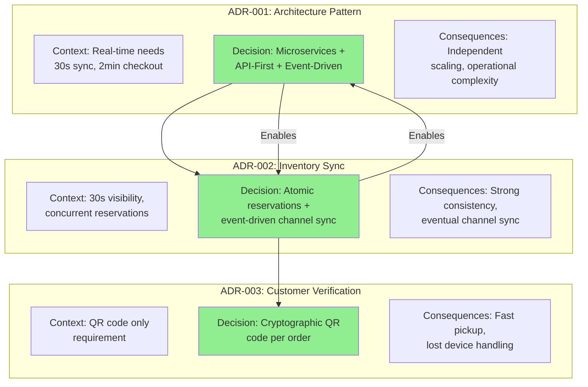
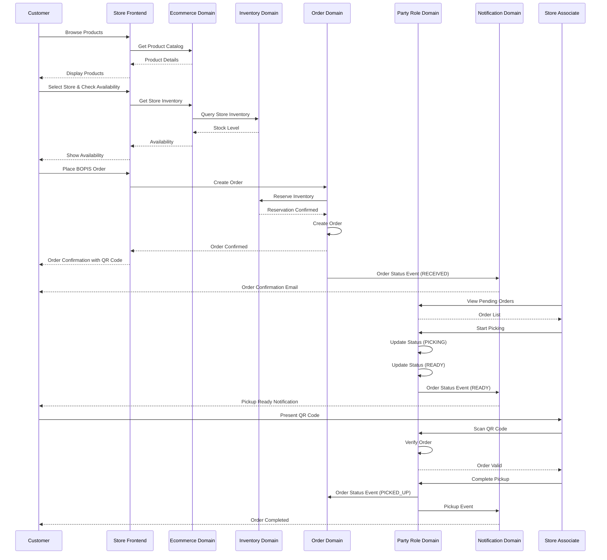
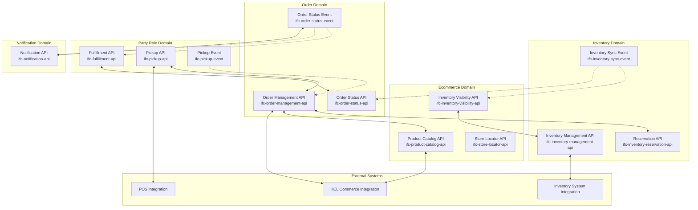

# BOPIS Solution Architecture Design

## 1. Overview and Context

The Buy Online, Pick Up In Store (BOPIS) solution enables cross-channel shopping by integrating HCL Commerce e-commerce platform with POS and inventory management systems. Customers browse products online, view real-time store inventory, place BOPIS orders, and pick up in-store.

### Context Evidence

- **Workspace ID**: project (local Git mode)
- **Cascade State**: Solution Architecture (draft), Requirements (ready_for_advancement_review)
- **Requirements Baseline**: `architecture/requirements/requirements.yml`
- **Generated**: 2025-02-27

### System Overview Diagram

## 2. Architectural Drivers

### Non-Functional Requirements (NFRs)

| ID | Requirement | Target | Source Req |
|----|-------------|--------|------------|
| nfr-availability | System must maintain 99.5% uptime during store operating hours (8am-10pm) | >= 99.5% | nfr-availability |
| nfr-inventory-sync | Inventory visibility updates must reflect within 30 seconds of reservation | <= 30 seconds | nfr-inventory-sync |
| nfr-checkout-latency | Checkout flow must complete within 2 minutes for BOPIS orders | <= 2 minutes | nfr-checkout-latency |
| nfr-associate-ui-latency | Store associate interface must load within 3 seconds | <= 3 seconds | nfr-associate-ui-latency |
| nfr-notification-latency | Customer pickup notifications must be sent within 2 minutes of order readiness | <= 2 minutes | nfr-notification-latency |
| nfr-throughput | System must support concurrent BOPIS transactions during peak periods | >= 100 orders/minute per store cluster | nfr-throughput |
| nfr-security | Customer data must be encrypted at rest and in transit | AES-256 encryption, TLS 1.3 | nfr-security |
| nfr-data-retention | BOPIS order data must be retained for compliance and audit purposes | >= 7 years | nfr-data-retention |
| nfr-recovery-time | System must recover from failures within acceptable timeframes | RTO < 4 hours, RPO < 1 hour | nfr-recovery-time |

### Constraints

- Must integrate with HCL Commerce e-commerce platform
- Must integrate with existing POS and inventory management systems
- Must comply with PCI DSS for payment processing
- Must comply with GDPR for customer data processing and storage
- Must comply with CCPA for California resident data privacy
- Must comply with local data protection regulations for international stores
- BOPIS capability must be available during store operating hours (8am-10pm)

### Regulatory Compliance

- PCI DSS
- GDPR
- CCPA
- Local data protection regulations (international stores)

### NFR Traceability Diagram

## 3. System Architecture

### Architecture Patterns

#### Microservices
- **Rationale**: Domain decomposition enables independent development, deployment, and scaling of Ecommerce, Inventory, Order, Fulfillment, and Notification domains
- **NFR Driver**: nfr-throughput, nfr-availability

#### API-First
- **Rationale**: All integrations between domains and external systems (HCL Commerce, POS, inventory, email/SMS) use well-defined REST APIs with clear contracts
- **NFR Driver**: nfr-checkout-latency, nfr-inventory-sync

#### Event-Driven
- **Rationale**: Inventory reservations, order state changes, and notifications propagate asynchronously via events for real-time accuracy without blocking
- **NFR Driver**: nfr-inventory-sync, nfr-notification-latency

#### CQRS
- **Rationale**: Order read (customer queries) and write (order placement) operations are separated to optimize performance and scalability
- **NFR Driver**: nfr-throughput, nfr-checkout-latency

### Deployment Topology

Multi-tier cloud deployment with:
- **API Gateway Layer**: Rate limiting, authentication, routing
- **Application Microservices Layer**: Ecommerce, Inventory, Order, Fulfillment, Notification domains
- **Data Layer**: Relational database, event bus, cache
- **External Integration Layer**: HCL Commerce, POS, inventory systems

Store associate tablets connect via mobile app to Party Role Management domain APIs. Customers access via HCL Commerce storefront.

### Architecture Patterns Diagram

## 4. Domain Decomposition

### Ecommerce Domain
- **Description**: Manages product catalog, store location search, and BOPIS inventory visibility for online customers. Integrates with HCL Commerce platform to provide product data and store inventory information.
- **Interface Contracts**: ifc-product-catalog-api, ifc-store-locator-api, ifc-inventory-visibility-api
- **Component Specs**: `architecture/solution/domain-handoffs/ecommerce/component-specs.yml`

### Inventory Domain
- **Description**: Manages product inventory across stores, handles real-time reservations, and synchronizes inventory with external systems.
- **Interface Contracts**: ifc-inventory-management-api, ifc-inventory-reservation-api, ifc-inventory-sync-event
- **Component Specs**: `architecture/solution/domain-handoffs/inventory/component-specs.yml`

### Order Domain
- **Description**: Manages BOPIS order lifecycle from placement through pickup completion. Handles order status tracking and customer queries.
- **Interface Contracts**: ifc-order-management-api, ifc-order-status-api, ifc-order-status-event
- **Component Specs**: `architecture/solution/domain-handoffs/order/component-specs.yml`

### Party Role Management Domain
- **Description**: Manages store associate interface for order fulfillment and pickup processing. Handles QR code verification and order completion.
- **Interface Contracts**: ifc-fulfillment-api, ifc-pickup-api, ifc-pickup-event
- **Component Specs**: `architecture/solution/domain-handoffs/party-role/component-specs.yml`

### Notification Domain
- **Description**: Manages customer notifications for order readiness and pickup instructions via email and SMS.
- **Interface Contracts**: ifc-notification-api
- **Component Specs**: `architecture/solution/domain-handoffs/notification/component-specs.yml`

### Domain Decomposition Diagram

### Cross-Cutting Concerns

## 5. NFR Budget Allocation

### Per-Tier Budgets

| Tier | Latency Budget | Availability | Throughput (RPS) | Cost Envelope |
|------|----------------|-------------|------------------|---------------|
| API Gateway | 100ms | 99.9% | 1000 | M |
| Application Services | 200ms | 99.5% | 500 | L |
| Data Layer | 50ms | 99.9% | 1000 | XL |
| External Integrations | 500ms | 95.0% | 100 | M |

### NFR Budget Distribution Diagram

## 6. TMF Alignment

### ODA Components

| Name | ODA Component ID | ODA Component | Functional Block | Confidence | Validation Status |
|------|------------------|---------------|-----------------|------------|-------------------|
| Product Catalog Management | TMFC001 | ProductCatalogManagement | CoreCommerce | mcp_verified | verified |
| Product Inventory Management | TMFC005 | ProductInventory | CoreCommerce | mcp_verified | verified |
| Order Management | TMFC003 | OrderManagement | Fulfillment | mcp_verified | verified |
| Party Role Management | TMFC006 | PartyRoleManagement | Fulfillment | local_knowledge | not_mapped |

### Open APIs

| ID | Version | API Name | Confidence | Validation Status |
|----|---------|----------|------------|-------------------|
| TMF620 | - | Product, ProductOffering | mcp_verified | verified |
| TMF637 | - | Product Inventory | mcp_verified | verified |
| TMF629 | - | Party Role | mcp_verified | verified |

### SID Entities

| Domain | Entity Name | ABE | Confidence | Validation Status |
|--------|-------------|-----|------------|-------------------|
| Order | CustomerProductOrder | Customer Product Order ABE | mcp_verified | verified |
| Order | CustomerProductOrderItem | Customer Product Order ABE | mcp_verified | verified |
| Order | BusinessPartnerProductOrderItem | Business Partner Product Order ABE | mcp_verified | verified |
| Ecommerce | ProductOrder | Product Order ABE | mcp_verified | verified |
| Inventory | ProductInventory | Product Inventory ABE | mcp_verified | verified |

### eTOM Processes by Domain

#### Ecommerce Domain
- 1.2.7.2.3 - Product Offering Cataloging (Level 4, Product Domain)
- 1.3.1.2.1 - Support Customer Order Management (Level 3, Customer Domain)
- 1.2.7.2.3.2 - Product Offering Lifecycle Management (Level 6, Product Domain)
- 1.2.7.2.2 - Associate Product Offering with Product Offering Catalog (Level 6, Product Domain)

#### Inventory Domain
- 1.2.11 - Product Inventory Management (Level 2, Product Domain)
- 1.2.11.4 - Ensure Product Inventory Quality (Level 3, Product Domain)
- 1.7.10.2.3 - Develop Stock/Inventory Management Policy (Level 4, Enterprise Domain)
- 1.7.5.4.4 - Managing inventory Transactions (Level 4, Enterprise Domain)
- 1.7.10.5.1 - Manage Inventory (Level 4, Enterprise Domain)

#### Order Domain
- 1.3.1.2 - Support Customer Order Management (Level 3, Customer Domain)
- 1.3.3.18.1 - Define Customer Order Policy (Level 4)
- 1.3.3.16 - Manage Customer Order Management Report (Level 3)
- 1.3.3.10 - Manage Customer Order Placement (Level 3)
- 1.3.20 - Customer Lifecycle Management (Level 2)

#### Fulfillment (Party Role) Domain
- 1.5.5.8 - Manage Resource Order Fulfillment (Level 3, Resource Domain)
- 1.3.3.12 - Manage Customer Order Fulfillment (Level 3)
- 1.7.10.6 - Manage Fulfillment (Level 3, Enterprise Domain)
- 1.3.19.3.2 - Deliver Customer Order Carry Through Capability (Level 4)
- 1.6.8.4.2 - Accept Business Partner Order (Level 4, Business Partner Domain)

### TMF Alignment Diagram

```mermaid
graph TB
    subgraph "ODA Components"
        ODA1[Product Catalog Management<br/>TMFC001]
        ODA2[Product Inventory Management<br/>TMFC005]
        ODA3[Order Management<br/>TMFC003]
        ODA4[Party Role Management<br/>TMFC006]
    end

    subgraph "Open APIs"
        API1[TMF620<br/>Product, ProductOffering]
        API2[TMF637<br/>Product Inventory]
        API3[TMF629<br/>Party Role]
    end

    subgraph "SID Entities"
        SID1[CustomerProductOrder]
        SID2[CustomerProductOrderItem]
        SID3[BusinessPartnerProductOrderItem]
        SID4[ProductOrder]
        SID5[ProductInventory]
    end

    subgraph "Solution Domains"
        SD1[Ecommerce]
        SD2[Inventory]
        SD3[Order]
        SD4[Party Role]
    end

    ODA1 --> SD1
    ODA2 --> SD2
    ODA3 --> SD3
    ODA4 --> SD4

    API1 --> SD1
    API1 --> SD3
    API2 --> SD2
    API3 --> SD4

    SID4 --> SD1
    SID5 --> SD2
    SID1 --> SD3
    SID2 --> SD3
    SID3 --> SD3
```

### TMF Validation Status

- **Validation Plan**: `architecture/solution/tmf-validation-plan.md`
- **Validation Status**: mcp_verified
- **Validation Date**: 2025-02-27

## 7. Architecture Decisions

### ADR-001: Architecture Pattern - Microservices with API-First and Event-Driven Design

**Status**: Proposed

**Context**: BOPIS requires real-time inventory visibility, order tracking across multiple systems (HCL Commerce, POS, inventory management), and low-latency customer/associate interfaces. Requirements specify 30-second inventory sync, 2-minute checkout, and support for 1,000 orders/day.

**Decision**: Adopt microservices architecture with API-first contracts between domains and event-driven synchronization for inventory and order state changes. Five domains (Ecommerce, Inventory, Order, Fulfillment, Notification) provide clear ownership boundaries and enable independent scaling.

**Consequences**:
- **Benefits**: Independent development/deployment per domain, clear ownership, better scalability
- **Trade-offs**: Increased operational complexity, requires robust API governance and event schema management

**Alternatives**:
- Monolithic application: Simpler deployment but harder to scale and maintain with multiple integration points
- Modular monolith: Middle ground but still has shared deployment and scaling constraints

---

### ADR-002: Inventory Synchronization Strategy - Event-Driven with Atomic Reservations

**Status**: Proposed

**Context**: Requirements specify inventory must reflect within 30 seconds of reservation and handle concurrent reservations without race conditions. 1,000 orders/day with peak loads require accurate inventory visibility.

**Decision**: Use atomic database transactions for inventory reservation at order placement, followed by event-driven synchronization to propagate inventory changes to all channels. Events published to event bus for real-time updates to Ecommerce, Order, and external systems.

**Consequences**:
- **Benefits**: Strong consistency for reservations, real-time channel updates, no overselling
- **Trade-offs**: Eventual consistency for channel sync, requires idempotent event consumers and replay capability

**Alternatives**:
- Polling sync: Simpler but higher latency and resource usage
- Direct API calls: Tight coupling, no decoupling, cascading failures

---

### ADR-003: Customer Verification - QR Code Only

**Status**: Proposed

**Context**: Requirements specify QR code only verification for BOPIS pickup. No additional ID or phone verification required. This balances security with customer convenience.

**Decision**: Generate unique QR code per order containing order identifier and cryptographic signature. Store associates scan QR code via tablet app to validate order and complete pickup.

**Consequences**:
- **Benefits**: Fast pickup experience, minimal customer friction, secure verification
- **Trade-offs**: Requires secure QR code generation and verification logic, lost device handling process needed

**Alternatives**:
- Order number + phone verification: More verification steps but no device requirement
- Government ID verification: Stronger security but poor customer experience

### ADR Decision Flow Diagram

## 8. Mermaid Diagrams

### BOPIS Customer Journey

### Component Interaction Diagram

---

*This architecture design document is generated from the machine-authoritative YAML file at `architecture/solution/architecture-design.yml` and should be regenerated when the source YAML changes.*
